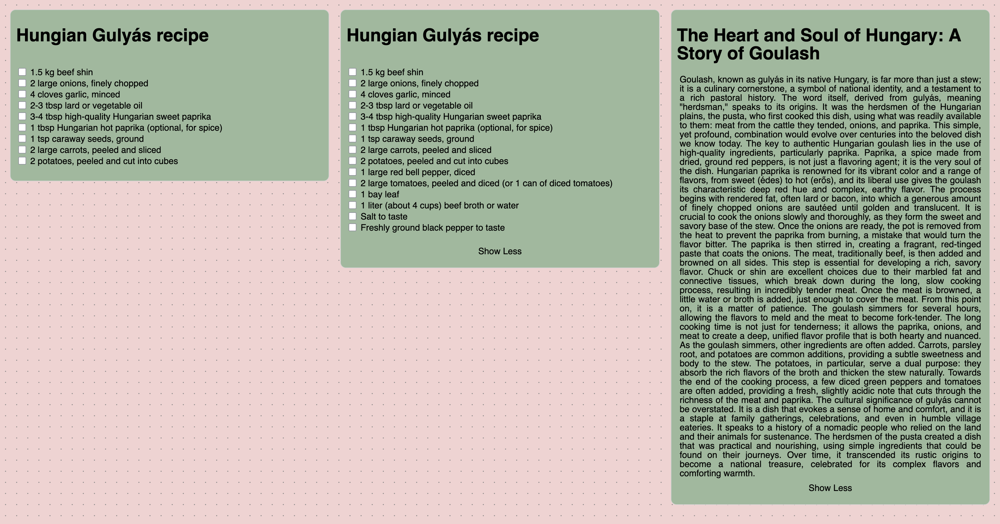
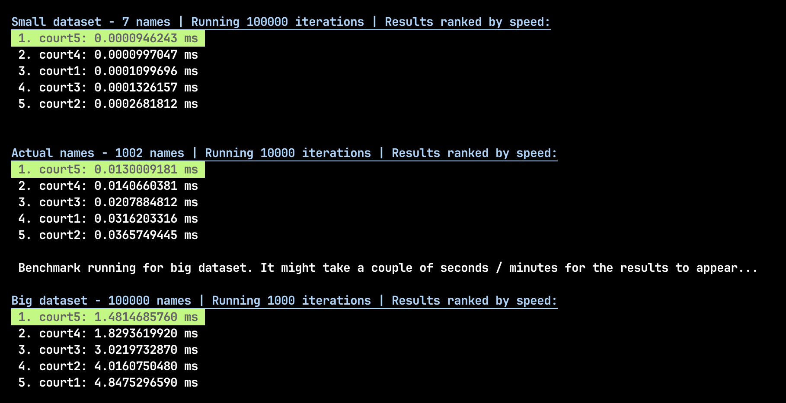

# Job Interview Assignment

This project was created as part of a job interview process.

## Task 1 - HTML Recipes

The first task is implemented in the `index.html` file. It can be opened as a file in any browser or by clicking [this link.](https://sandornagy517.github.io/assignment)

## Task 2 - JavaScript optimization

The second task, including its iterations, is contained within the `court.js` file. I was not sure if the code should be production ready so I've assumed that the inputs will always be correct.

- The number of judges is always an integer and bigger than 0
- The name always has at least 1 character
- The list of people is always a string

### Optimization steps

The optimization documentation is contained in [this document](OPTIMIZATION.md).

### Benchmarking

Tool versions:

- node v22.8.0
- npm 10.8.2

I've included 3 benchmarks: **small**, **medium** and **large**.

- small: only 7 predefined names.
- medium: 1000 predefined names (defined in `mock_generator.js`)
- large: 100,000 names all randomized and capitalized

**Follow these steps to run the benchmarks**:

- npm install
- npm run start

The following should appear in the terminal:

### Unit tests

Unit tests exists in the `court.test.js` file for the second assignment.
